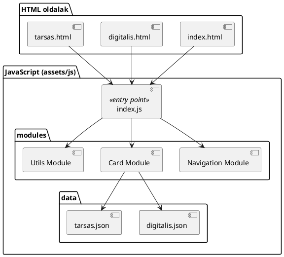

# Weboldal dokumentáció – Digitális és társasjátékok
Projekt célja
A projekt célja egy olyan egyszerű, mégis jól bővíthető weboldal elkészítése, amely különböző típusú játékokat mutat be.
A weboldal két fő kategóriára bontja a tartalmat:

Digitális játékok
Társasjátékok

A megvalósítás során fontos szempont volt, hogy az oldal később továbbfejleszthető legyen, például adatbázisos tárolás irányába.

Weboldal felépítése
A weboldal két külön HTML oldalból áll, amelyek egy közös navigációs menüből érhetők el:

Digitális játékok oldala
Társasjátékok oldala

Mindkét oldal azonos szerkezetet és megjelenést használ, ezzel biztosítva az egységes felhasználói élményt.

Navigáció
A weboldalon egy egyszerű navigációs menü található, amely lehetővé teszi az oldalak közötti váltást:

Digitális játékok
Társasjátékok

A navigáció minden oldalon elérhető, így a felhasználó könnyen mozoghat a tartalmak között.

Tartalom megjelenítése (kártyák)
Mindkét oldalon négy darab kártya jelenik meg egymás mellett.
Egy kártya az alábbi elemeket tartalmazza:

Egy kép a játékról
Egy rövid leírás
Egy gomb, amely megjeleníti a bővebb leírást

A kártyák célja, hogy átlátható és vizuálisan rendezett módon mutassák be a játékokat.

Stílus (CSS)
A weboldal megjelenését egy külön CSS fájl szabályozza.
A CSS feladata:

A kártyák elrendezése (négy elem egymás mellett)
Színek, betűtípusok és margók beállítása
Gombok megjelenésének formázása
Egységes kinézet biztosítása mindkét oldalon

A stílus elkülönítése a HTML-től segíti a tiszta és átlátható projektstruktúrát.

Dinamikus működés (JavaScript)
A JavaScript feladata a weboldal dinamikus működésének biztosítása.
A JavaScript segítségével:

A kártyák automatikusan jelennek meg az adatok alapján
A „Bővebb leírás” gomb működése megvalósul
Az adatok nem közvetlenül a HTML-ben szerepelnek

Ez a megközelítés megkönnyíti a karbantartást és a továbbfejlesztést.

Adattárolás (JSON)
A játékok adatai JSON fájlban vannak eltárolva.
A JSON fájl tartalmazza például:

A játék nevét
A kép elérési útját
A rövid leírást
A bővebb leírást
A játék típusát (digitális vagy társas)

Ez a megoldás azért előnyös, mert:

Könnyen bővíthető új játékokkal
Később egyszerűen lecserélhető adatbázisra
Elkülöníti az adatokat a megjelenítéstől


Továbbfejlesztési lehetőségek
A projekt kialakítása lehetőséget ad a későbbi bővítésre, például:

Adatbázis használata (pl. MySQL)
Kereső funkció a játékok között
Szűrés játék típus vagy népszerűség alapján
Admin felület új játékok hozzáadásához
Reszponzív megjelenés mobil eszközökre


Összegzés
A weboldal egy jól strukturált, könnyen érthető alapot biztosít egy játékbemutató rendszerhez.
A HTML, CSS, JavaScript és JSON elkülönített használata segíti az átláthatóságot és a továbbfejlesztést, így a projekt alkalmas tanulási és későbbi fejlesztési célokra is.

Projekt mappa struktúra
A projekt mappa struktúrája tudatosan lett kialakítva annak érdekében, hogy átlátható, jól szervezett és könnyen továbbfejleszthető legyen.
A struktúra elkülöníti egymástól a megjelenítést, az adatokat és az alkalmazás logikáját, valamint támogatja az automatizált tesztelést is.
A JavaScript alkalmazás belépési pontja az index.js fájl, amely az oldal működését vezérli és összefogja a különböző modulokat.

Mappa struktúra áttekintése
Az alábbi ábra a projekt logikai felépítését mutatja:
```
játék sarok/
│
├─ index.html
├─ digitalis.html
├─ tarsas.html
│
├─ assets/
│   ├─ images/
│   │   ├─ digitalis/
│   │   └─ tarsas/
│   │
│   ├─ css/
│   │   └─ style.css
│   │
│   └─ js/
│       ├─ data/
│       │   ├─ digitalis.json
│       │   └─ tarsas.json
│       │
│       ├─ modules/
│       │   ├─ card/
│       │   ├─ navigation/
│       │   └─ utils/
│       │
│       └─ index.js
│
├─ cypress/
│   ├─ e2e/
│   └─ fixtures/
│
└─ README.md
```

HTML fájlok szerepe
A projekt több HTML oldalt tartalmaz, amelyek külön fájlban helyezkednek el.

A digitális játékokat és a társasjátékokat bemutató oldalak külön HTML fájlokban vannak megvalósítva.
Az oldalak közös navigációt használnak, így a felhasználó könnyen válthat a kategóriák között.
Az oldalak szerkezete egységes, a dinamikus tartalom JavaScript segítségével jelenik meg.

Ez a megoldás segíti az átláthatóságot és az automatizált tesztelést.

Assets mappa
Az assets mappa tartalmaz minden olyan erőforrást, amely nem közvetlenül HTML fájl.
Képek (images)
A képek külön mappában találhatók, kategóriák szerint csoportosítva.
Ez megkönnyíti a digitális és a társasjátékok képeinek kezelését és későbbi bővítését.

Stíluslapok (css)
A projekt megjelenését egy központi CSS fájl szabályozza.
Ez felel az oldalak kinézetéért, a kártyák elrendezéséért, valamint az egységes megjelenésért minden oldalon.

JavaScript struktúra
A JavaScript fájlok az assets/js mappában helyezkednek el, és a weboldal működéséért felelnek.
Belépési pont (index.js)
Az index.js fájl a JavaScript alkalmazás belépési pontja.
Feladata:

az aktuális oldal felismerése,
a megfelelő adatok betöltésének indítása,
a modulok összekapcsolása és vezérlése.

Az index.js nem tartalmaz adatokat és nem végez megjelenítést, kizárólag az alkalmazás működését koordinálja.

Adatfájlok (data)
Az adatok JSON fájlokban vannak tárolva, külön a digitális játékok és külön a társasjátékok számára.
Ez az adatvezérelt megközelítés lehetővé teszi a könnyű bővíthetőséget és előkészíti a projektet egy későbbi adatbázisos megoldásra.

Modulok (modules)
A JavaScript logika moduláris felépítésű.
A különböző funkciók elkülönített modulokban helyezkednek el, például:

kártyák megjelenítéséért felelős logika,
navigáció működése,
általános segédfeladatok.

A moduláris struktúra javítja az átláthatóságot, csökkenti a kódismétlést, és megkönnyíti a karbantartást.

Tesztelési struktúra
A projekt struktúrája támogatja az automatizált tesztelést.
A Cypress tesztek külön mappában találhatók, ahol az end‑to‑end tesztesetek és a tesztadatok kerülnek elhelyezésre.
Ez lehetővé teszi a navigáció, a kártyák megjelenése és a felhasználói interakciók ellenőrzését.

Összegzés
A kialakított mappa struktúra biztosítja, hogy a projekt:

jól átlátható és logikusan felépített legyen,
könnyen bővíthető maradjon,
alkalmas legyen automatizált tesztelésre,
megfeleljen a modern frontend fejlesztési alapelveknek.


UML ábra – Rendszer felépítése
Ez az UML ábra a weboldal logikai felépítését mutatja be, különös tekintettel a JavaScript alkalmazás moduláris struktúrájára és az adatok áramlására.

UML komponens / logikai ábra



UML ábra magyarázata
HTML oldalak
Az UML ábra bal oldalán a HTML oldalak láthatók:

index.html
digitalis.html
tarsas.html

Ezek az oldalak nem tartalmaznak üzleti logikát, kizárólag a megjelenítés vázát adják.
Mindhárom oldal a JavaScript alkalmazás belépési pontjához kapcsolódik.

JavaScript belépési pont – index.js
Az index.js a rendszer központi vezérlőeleme (entry point).
Feladatai:

az aktuális oldal felismerése,
a megfelelő adatok betöltésének elindítása,
a modulok koordinálása.

Az UML ábrán jól látható, hogy minden HTML oldal közvetlenül az index.js fájlhoz kapcsolódik, így az alkalmazás működése központosított.

Modulok (modules)
A modules csomagban találhatók a funkcionálisan elkülönített logikai egységek.
Navigation Module

A navigáció működéséért felel
Egységes menüt biztosít minden oldalon
Elkülönítése megkönnyíti a karbantartást és a tesztelést

Card Module

A játékokat megjelenítő kártyák logikáját kezeli
Kapcsolatban áll az adatfájlokkal
Felel a kártyák megjelenítéséért és az interakciókért

Utils Module

Általános segédfeladatokat lát el
Nem kötődik közvetlenül sem a navigációhoz, sem a kártyákhoz
Csökkenti a kódismétlést


Adatfájlok (JSON)
Az UML ábra jobb oldalán láthatók az adatfájlok:

digitalis.json
tarsas.json

Ezek az állományok tartalmazzák a játékok adatait.
A Card Module közvetlen kapcsolatban áll velük, míg az alkalmazás többi része nem függ közvetlenül az adatok szerkezetétől.
Ez az adatvezérelt megközelítés lehetővé teszi:

az egyszerű bővíthetőséget,
a későbbi adatbázisos vagy API‑alapú fejlesztést.


UML ábra szerepe a fejlesztésben
Az UML ábra segít:

a rendszer logikai felépítésének megértésében,
a felelősségek egyértelmű elkülönítésében,
a moduláris gondolkodás bemutatásában,
az automatizált tesztelés (Cypress) megtervezésében,
a dokumentáció átláthatóbbá tételében.


Összegzés
A bemutatott UML ábra egy jól strukturált, moduláris frontend alkalmazást ír le, ahol:

a HTML oldalak csak a megjelenítést biztosítják,
az index.js központi vezérlőként működik,
a modulok elkülönített felelősségekkel rendelkeznek,
az adatok JSON fájlokban vannak tárolva.

Ez a felépítés megfelel a modern frontend fejlesztési alapelveknek, és jól támogatja a továbbfejlesztést és a tesztelést.


Drótváz (Wireframe) és felhasználói felület leírása
Ez a fejezet a weboldal tervezett felépítését és vizuális elrendezését mutatja be drótváz (wireframe) segítségével.
A drótváz célja, hogy a funkcionális elrendezést és az oldalelemek hierarchiáját szemléltesse, nem pedig a végleges dizájnt.

Általános oldalelrendezés
A weboldal minden oldala azonos alapstruktúrát követ:
+--------------------------------------------------+
|                 FEJLÉC / NAVIGÁCIÓ               |
|  [ Digitális játékok ] [ Társasjátékok ]         |
+--------------------------------------------------+

+--------------------------------------------------+
|                                                  |
|   KÁRTYA 1     KÁRTYA 2     KÁRTYA 3     KÁRTYA 4 |
|                                                  |
|  [ kép ]      [ kép ]      [ kép ]      [ kép ] |
|  Rövid        Rövid        Rövid        Rövid   |
|  leírás       leírás       leírás       leírás  |
|                                                  |
|  [ Bővebb ]   [ Bővebb ]   [ Bővebb ]   [ Bővebb]|
+--------------------------------------------------+


Navigáció (fejléc)
A fejlécben egy egyszerű navigációs menü található, amely minden oldalon azonos.
Tartalma:

Digitális játékok oldalra mutató menüpont
Társasjátékok oldalra mutató menüpont

Funkciója:

Oldalak közötti navigáció biztosítása
Felhasználói élmény javítása
Cypress teszteléshez jól azonosítható navigációs elemek biztosítása


Tartalmi rész – kártyás elrendezés
Az oldal fő tartalmi része kártyák formájában jeleníti meg a játékokat.
Kártyák elrendezése

Oldalanként 4 darab kártya
A kártyák egymás mellett, egy sorban helyezkednek el
Az elrendezést CSS biztosítja

Ez az elrendezés:

átlátható,
vizuálisan egységes,
jól skálázható későbbi bővítés esetén.


Egy kártya felépítése
Egy kártya az alábbi elemeket tartalmazza:
+--------------------------+
|          KÉP             |
+--------------------------+
| Rövid leírás a játékról  |
+--------------------------+
| [ Bővebb leírás ]        |
+--------------------------+

Kártyaelemek szerepe:

Kép: vizuális azonosítás
Rövid leírás: gyors áttekintés
Bővebb leírás gomb: interakció, amely megjeleníti a részletes információkat


Dinamikus működés a drótváz mögött
A drótvázban megjelenő kártyák nem statikusan szerepelnek a HTML-ben.
A működés logikai felépítése:

az adatok JSON fájlokban találhatók,
a JavaScript az adatokat feldolgozza,
a kártyák dinamikusan jelennek meg az oldalon.

Ez a megoldás:

csökkenti a HTML tartalmát,
megkönnyíti az adatok bővítését,
előkészíti az adatbázisos továbbfejlesztést.


Oldalspecifikus megjelenés
Digitális játékok oldal

Csak digitális játékok kártyái jelennek meg
Az adatok a digitális játékokhoz tartozó JSON fájlból származnak
Az oldal szerkezete megegyezik a társasjátékok oldaléval


Társasjátékok oldal

Csak társasjátékok kártyái jelennek meg
Az adatok a társasjátékokhoz tartozó JSON fájlból származnak
Az egységes struktúra biztosítja a következetes megjelenést


Drótváz előnyei a fejlesztés során
A drótváz használata az alábbi előnyöket biztosítja:

világos funkcionális elrendezés már a fejlesztés elején,
egyszerűbb CSS tervezés,
jól definiált JavaScript felelősségek,
Cypress tesztek könnyebb megtervezése,
egységes felhasználói élmény minden oldalon.


Összegzés
A bemutatott drótváz egy letisztult, jól strukturált weboldalt ír le, amely:

kártyás elrendezést használ,
adatvezérelt működésre épül,
könnyen tesztelhető és bővíthető,
megfelel a modern frontend fejlesztési alapelveknek.
